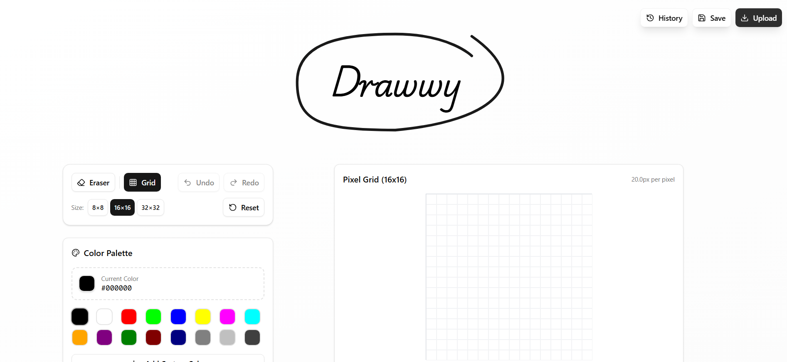

# Drawwy

Drawwy is a pixel art editor that allows you to create pixel art and share it with your friends! Your artwork is permanently stored on Arweave and can be shared with anyone using a simple link.

## Live Demo
Check it out: [drawwy_arlink.ar.io](https://drawwy_arlink.ar.io/?utm_source=github)

## What it does
- Draw pixel art on different grid sizes (8x8, 16x16, 32x32)
- Choose from lots of colors or add your own
- Undo and redo your changes
- Export your creations
- Permanently store your artwork on Arweave - your creations are saved forever
- It can be shared with anyone via a simple link!

Perfect for making simple pixel art, icons, or just having fun drawing!

## Stats for Nerds
- Next.js
- Ardacity UI
- Ardrive Turbo SDK

## Author
crafted with ❤️ by [aykansal](https://x.com/aykansal)